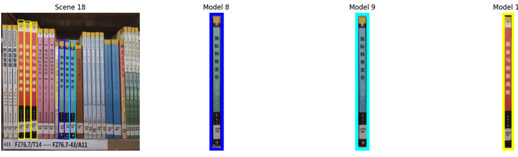

# Book_Shelf_Automatic_Recognition

This notebook contains the first assignement of Image Processing and Computer Vision course of my Master's degree in AI at university of Bologna.
In particular, this project uses techniques of image processing, so NO deep learning related, in order to recognize books from in store shelves.

The core approach is a **feature-based object detection** pipeline, relying on robust feature extraction, efficient matching, and rigorous post-processing validation.

### 1. Feature Extraction and Matching

| Step | Algorithm | Description | Parameters (Key Tunings) |
| :--- | :--- | :--- | :--- |
| **Extraction** | **SIFT** (Scale-Invariant Feature Transform) | Used for robust, scale-invariant keypoint detection and descriptor generation. | **High Sensitivity:** `contrastThreshold=0.0005`, `edgeThreshold=11`, `nOctaveLayers=4` (tuned to capture faint book features/spines, increasing feature density). |
| **Matching** | **FLANN** (Fast Library for Approximate Nearest Neighbors) with KNN | Utilized for high-speed approximate descriptor matching between the model and scene. | `FLANN_INDEX_KDTREE`, `trees=20`, `checks=200` |
| **Filtering** | **Lowe's Ratio Test** | A match is deemed "good" only if the distance to the closest neighbor is significantly smaller than the distance to the second-closest neighbor ($d_1 / d_2 < 0.7$). | Ratio of $0.7$ |

### 2. Localization and Geometric Transformation

| Step | Algorithm | Description | Thresholds |
| :--- | :--- | :--- | :--- |
| **Homography** | **RANSAC** (Random Sample Consensus) | Robustly estimates the perspective transformation matrix ($M$) that maps model keypoints to scene keypoints, while effectively filtering out remaining outliers | Min. `MIN_MATCH_COUNT = 25` |
| **Projection** | `cv2.perspectiveTransform` | Applies the Homography matrix $M$ to the four corner points of the reference model to localize the object in the scene. | - |

### 3. Multi-Instance Strategy (Keypoint Removal)

A crucial component for detecting multiple identical books in a single scene:

1.  After a valid book instance is localized, the system identifies all SIFT keypoints within the detected bounding box (the projected corners).
2.  These keypoints and their corresponding descriptors are **removed** from the scene's feature set.
3.  The detection loop continues with the *remaining* scene features, ensuring the next iteration can find a different instance without re-detecting the first one.

---

## Validation Checks

To counteract the noise introduced by the high-sensitivity SIFT settings, every potential detection undergoes a rigorous validation sequence before being accepted:

| Check | Criterion | Purpose | Parameter |
| :--- | :--- | :--- | :--- |
| **1. Area Check** | Detected bounding box area must be between `MIN_DETECTION_AREA` and `MAX_DETECTION_AREA`. | Filters out spurious noise (too small) or overly large/incorrect matches. | `1000 px` to `70000 px` |
| **2. Rectangularity** | The cosine of the angles between adjacent edges of the projected shape must be close to 0 (i.e., near 90°). | Ensures the shape is geometrically plausible as a book spine, allowing tolerance for perspective distortion. | `ANGLE_COS_TOLERANCE = 0.64` |
| **3. Color Consistency** | The HSV color histogram of the detected ROI is compared to the model's histogram using **Chi-Square Distance**. | Discards geometrically correct matches that are visually inconsistent (e.g., a book with the same dimensions but a different color cover). | `COLOR_HIST_THRESHOLD = 200` |

---
